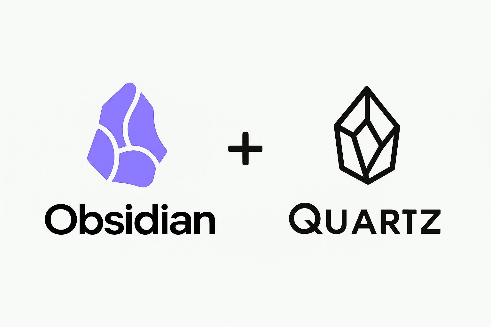

# obsidian-quartz



## Мотивация

Многие существующие шаблоны и примеры Quartz требуют сложной настройки, что затрудняет быстрый запуск веб-сайта на основе Obsidian. Этот минимальный шаблон создан с целью максимально упростить процесс подготовки вашего Obsidian-хранилища к публикации в веб.

С помощью этого шаблона вы сможете:
- Быстро развернуть веб-версию вашего Obsidian-хранилища
- Избежать лишних настроек и конфигураций
- Сконцентрироваться на создании контента, а не настройке инфраструктуры

## Примеры CI/CD

### GitHub Actions

```yaml
name: Build and Deploy Quartz

on:
  push:
    branches: [ main ]
  pull_request:
    branches: [ main ]
  workflow_dispatch:

# Добавляем явные разрешения для GitHub Actions
permissions:
  contents: write

jobs:
  build:
    runs-on: ubuntu-latest
    
    steps:
      - name: Checkout repository
        uses: actions/checkout@v4
        
      - name: Setup Node.js
        uses: actions/setup-node@v4
        with:
          node-version: 20
          
      - name: Clone Quartz and copy content
        run: |
          git clone https://github.com/jackyzha0/quartz.git temp_quartz
          cd temp_quartz
          npm i
          mkdir -p content
          # Создаем простой файл index.md если у нас еще нет контента
          echo "# Моя цифровая библиотека\n\nДобро пожаловать в мою цифровую библиотеку, созданную с помощью Quartz." > content/index.md
          # Возвращаемся в корневую директорию
          cd ..
          
          # Создаем и запускаем скрипт копирования контента
          cat > copy_content.sh << 'EOF'
          #!/bin/bash
          # Максимальная длина имени файла
          MAX_LENGTH=180
          
          # Функция для сокращения длинных имен файлов
          shorten_filename() {
            local original_name="$1"
            local extension="${original_name##*.}"
            local basename="${original_name%.*}"
            
            if [ ${#original_name} -gt $MAX_LENGTH ]; then
              # Сокращаем имя файла, сохраняя начало и конец, добавляя хеш для уникальности
              local hash=$(echo "$original_name" | md5sum | cut -c1-8)
              local name_length=$(($MAX_LENGTH - ${#extension} - ${#hash} - 10))
              local prefix_length=$(($name_length / 2))
              local suffix_length=$(($name_length - $prefix_length))
              
              local prefix="${basename:0:$prefix_length}"
              local suffix="${basename:$((${#basename} - $suffix_length)):$suffix_length}"
              local new_name="${prefix}_${hash}_${suffix}.${extension}"
              
              echo "Сокращено: $original_name -> $new_name" >&2
              echo "$new_name"
            else
              echo "$original_name"
            fi
          }
          
          # Создаем директорию для медиа-файлов в Quartz
          mkdir -p temp_quartz/content/assets
          
          # Копирование файлов markdown из корня
          for file in *.md; do
            if [ -f "$file" ]; then
              target_file=$(shorten_filename "$file")
              cp "$file" "temp_quartz/content/$target_file" || echo "Не удалось скопировать $file"
            fi
          done
          
          # Копирование изображений из корня
          for img in *.{png,jpg,jpeg,gif,svg,webp}; do
            if [ -f "$img" ]; then
              target_img=$(shorten_filename "$img")
              cp "$img" "temp_quartz/content/assets/$target_img" || echo "Не удалось скопировать $img"
            fi
          done
          
          # Копирование директорий
          for dir in */; do
            # Пропускаем системные директории и temp_quartz
            if [[ "$dir" != "temp_quartz/" && "$dir" != ".git/" && "$dir" != "node_modules/" && "$dir" != "public/" && "$dir" != ".github/" ]]; then
              dir_name=${dir%/}
              shortened_dir=$(shorten_filename "$dir_name")
              mkdir -p "temp_quartz/content/$shortened_dir"
              
              # Копируем markdown файлы из директории
              find "$dir" -type f -name "*.md" | while read file; do
                filename=$(basename "$file")
                shortened_file=$(shorten_filename "$filename")
                cp "$file" "temp_quartz/content/$shortened_dir/$shortened_file" || echo "Не удалось скопировать $file"
              done
              
              # Копируем изображения в assets
              find "$dir" -type f \( -name "*.png" -o -name "*.jpg" -o -name "*.jpeg" -o -name "*.gif" -o -name "*.svg" -o -name "*.webp" \) | while read file; do
                filename=$(basename "$file")
                shortened_file=$(shorten_filename "$filename")
                cp "$file" "temp_quartz/content/assets/$shortened_file" || echo "Не удалось скопировать $file"
              done
            fi
          done
          EOF
          chmod +x copy_content.sh
          ./copy_content.sh
          
      - name: Build Quartz site
        run: |
          cd temp_quartz
          echo "" | npx quartz create
          npx quartz build
          cp -r public ../public
          
      - name: Deploy to GitHub Pages
        uses: peaceiris/actions-gh-pages@v3
        with:
          github_token: ${{ secrets.GITHUB_TOKEN }}
          publish_dir: public
```

> **Важно:** Для корректной работы GitHub Actions необходимо настроить репозиторий для публикации в ветку `gh-pages`:
> 1. Перейдите в настройки репозитория (Settings)
> 2. Выберите раздел Pages
> 3. В Source выберите "Deploy from a branch"
> 4. В Branch выберите "gh-pages" и папку "/ (root)"
> 5. Нажмите Save
> 
> Также необходимо настроить разрешения для workflows:
> 1. Перейдите в Settings -> Actions -> General -> Workflow permissions
> 2. Выберите "Read and write permissions" (Разрешения на чтение и запись)
> 3. Нажмите Save
>
> После первого запуска workflow и создания ветки gh-pages, ваш сайт будет доступен по адресу https://username.github.io/repository-name/

### GitLab CI

```yaml
stages:
  - build
  - deploy

build:
  stage: build
  image: node:20
  script:
    - git clone https://github.com/jackyzha0/quartz.git temp_quartz
    - cd temp_quartz
    - npm i
    - mkdir -p content
    # Создаем простой файл index.md если у нас еще нет контента
    - echo "# Моя цифровая библиотека\n\nДобро пожаловать в мою цифровую библиотеку, созданную с помощью Quartz." > content/index.md
    # Копируем весь контент из корня репозитория, исключая системные папки и проблемные файлы
    - cd ..
    # Создаем скрипт для обработки файлов и копирования с сокращением длинных имен
    - |
      cat > copy_content.sh << 'EOF'
      #!/bin/bash
      # Максимальная длина имени файла
      MAX_LENGTH=180
      
      # Функция для сокращения длинных имен файлов
      shorten_filename() {
        local original_name="$1"
        local extension="${original_name##*.}"
        local basename="${original_name%.*}"
        
        if [ ${#original_name} -gt $MAX_LENGTH ]; then
          # Сокращаем имя файла, сохраняя начало и конец, добавляя хеш для уникальности
          local hash=$(echo "$original_name" | md5sum | cut -c1-8)
          local name_length=$(($MAX_LENGTH - ${#extension} - ${#hash} - 10))
          local prefix_length=$(($name_length / 2))
          local suffix_length=$(($name_length - $prefix_length))
          
          local prefix="${basename:0:$prefix_length}"
          local suffix="${basename:$((${#basename} - $suffix_length)):$suffix_length}"
          local new_name="${prefix}_${hash}_${suffix}.${extension}"
          
          echo "Сокращено: $original_name -> $new_name" >&2
          echo "$new_name"
        else
          echo "$original_name"
        fi
      }
      
      # Копирование файлов markdown из корня
      for file in *.md; do
        if [ -f "$file" ]; then
          target_file=$(shorten_filename "$file")
          cp "$file" "temp_quartz/content/$target_file" || echo "Не удалось скопировать $file"
        fi
      done
      
      # Копирование директорий
      for dir in */; do
        # Пропускаем системные директории и temp_quartz
        if [[ "$dir" != "temp_quartz/" && "$dir" != ".git/" && "$dir" != "node_modules/" && "$dir" != "public/" ]]; then
          dir_name=${dir%/}
          shortened_dir=$(shorten_filename "$dir_name")
          mkdir -p "temp_quartz/content/$shortened_dir"
          
          # Копируем файлы из директории, сокращая длинные имена
          find "$dir" -type f -name "*.md" | while read file; do
            filename=$(basename "$file")
            shortened_file=$(shorten_filename "$filename")
            cp "$file" "temp_quartz/content/$shortened_dir/$shortened_file" || echo "Не удалось скопировать $file"
          done
        fi
      done
      EOF
    - chmod +x copy_content.sh
    - ./copy_content.sh
    - cd temp_quartz
    # Запускаем создание Quartz без интерактивных вопросов
    - echo "" | npx quartz create
    - npx quartz build
    - cp -r public ../public  # Копируем результат сборки в корневую директорию для GitLab Pages
  artifacts:
    paths:
      - public/
    expire_in: 1 week

pages:
  stage: deploy
  needs:
    - build
  script:
    - echo "Деплой на GitLab Pages выполнен автоматически"
  artifacts:
    paths:
      - public

```


## Настройка GitLab Pages

Для публичного доступа к вашему сайту через GitLab Pages необходимо:

1. Перейти в настройки вашего проекта (Settings)
2. В левом меню выбрать "Pages"
3. В разделе "Access Control" убедиться что:
   - Опция "Pages access control" отключена для публичного доступа
   - Или настроена в соответствии с вашими требованиями безопасности


